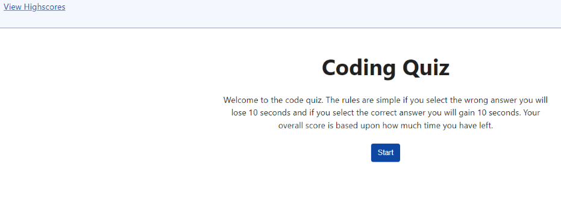

# coding-quiz

[Link to my project](https://github.com/Deiontre10/coding-quiz)

## Table of Contents
- [Description](#description)
- [Visuals](#visuals)

## Description
Code Quiz is an easy way to test your knowledge of javascript! You can play as many times as you want until you get all the questions correct. Your score is based on how quick you finish but there is a catch. You will lose points if you get a question wrong but you can gain points if you get a question correct.

Product Features: 
- Replay to try and beat your highscore.

- Score will increase by 10 for correct answers.

- Score will decrease by 10 for wrong answers.

## Visuals

